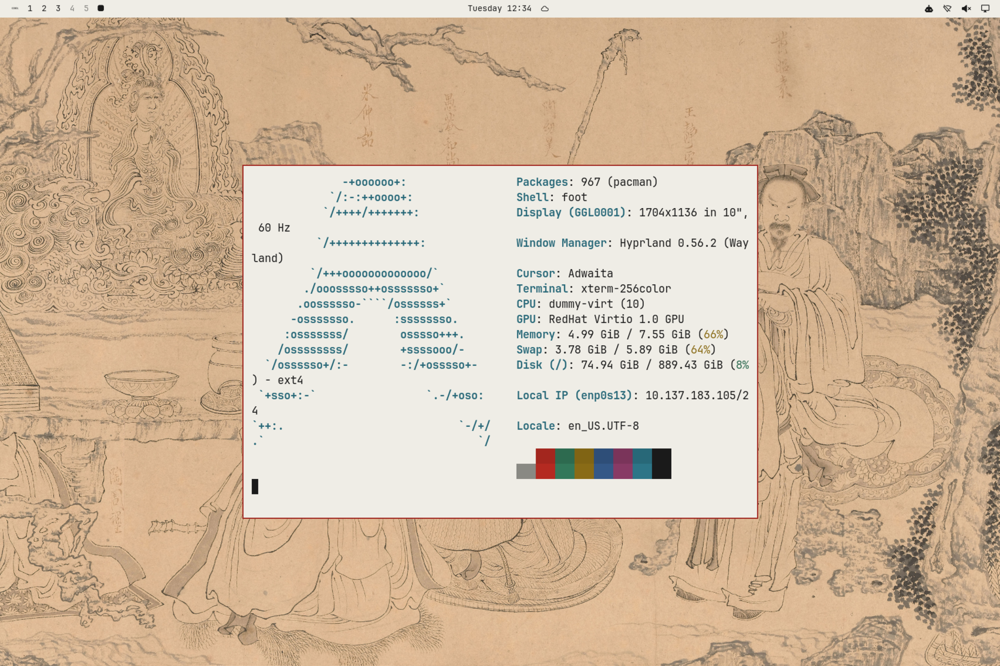

# 武侠 Wuxia

宣纸为底、浓墨为字、血色为印的浅色主题，深色版为 wuxia-night。壁纸选用已进入公有领域的中国古代侠义、人物画，截取局部铺满全屏。



## 安装

```bash
omarchy theme install https://github.com/rwanglq-ctrl/omarchy-wuxia-theme
```

## 壁纸来源

1. 陈洪绶《雅集图》卷局部，明（公有领域，图像来自 Wikimedia Commons）
2. 仇英《蜀道图》局部，明（公有领域，图像来自 Wikimedia Commons）
3. 龚开《中山出游图》局部，宋末元初，弗利尔美术馆（公有领域，图像来自 Wikimedia Commons）
4. 黄慎《苏武牧羊图》局部，清（公有领域，图像来自 Wikimedia Commons）

## 许可

- 壁纸：古画为公有领域作品，不受限制
- 配色与配置文件：MIT

详见 [LICENSE](LICENSE)。
